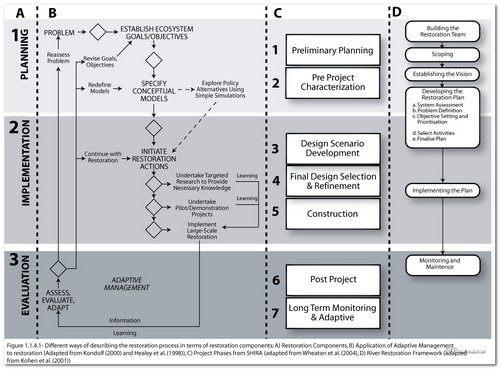

## Background

### Synopsis of Topic
Some synopsis...

)

### Why we're covering it

dd

### Learning Outcomes

* Build a working *understanding* of the typical **process** through which restoration projects are conceived, proposed, planned, permitted and conceptually designed. 

------
## Resources

### Slides & Handouts
dd

### Relevant or Cited Literature

----
← [Previous Topic](1_Course_I_Overview)      &nbsp;&nbsp;&nbsp;          [Next Topic](3_Assessing_Condition) →